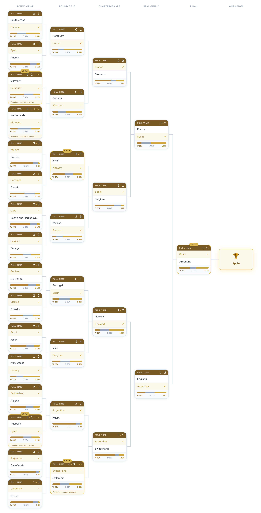
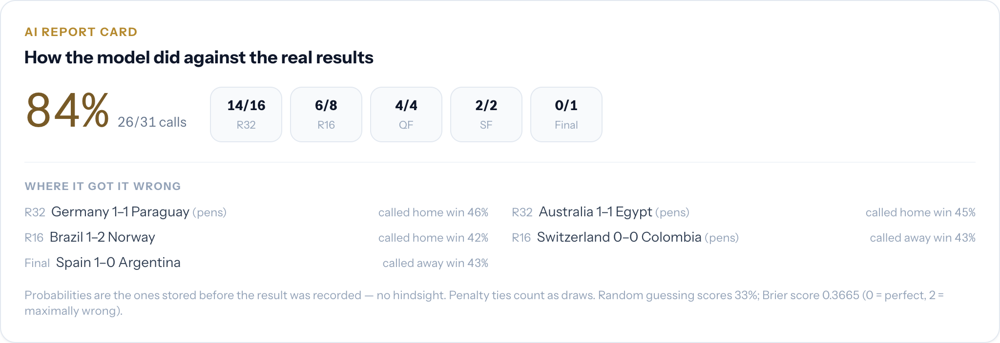
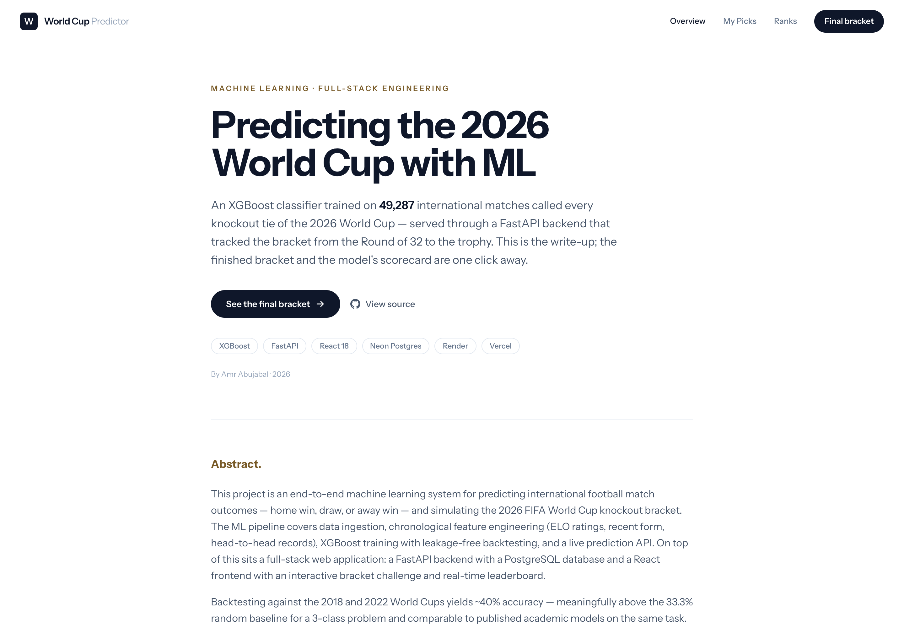

# FIFA World Cup 2026 Predictor

A full-stack machine learning app that tracked the 2026 FIFA World Cup knockout stage from the
Round of 32 to the trophy. An XGBoost classifier priced every tie as soon as it was set; the app recorded each result as it landed, scored user brackets against it, and now keeps
the finished bracket and the model's scorecard on the record.

**Live app:** https://worldcup.amrabujabal.com

---

## Screenshots

**The finished bracket** — every knockout tie with its final score, the model's stored pre-kickoff
W/D/L bar, upset flags and penalty footnotes.



**The AI report card** — the model scored against reality: 26/31, Brier 0.3665, broken down by round
with every miss named.



**Analysis** — the research write-up: data pipeline, features, and the leakage-free 2018/2022 backtest.



---

## Final state

- **Champions: Spain**, beating Argentina 1–0 in the final on 19 July 2026.
- All 31 knockout matches are recorded (R32 → Final), including three penalty shootouts, plus the
  third-place playoff (France 4–6 England) as slot 32, outside the bracket.
- The model's calls are frozen at the probabilities it held _before the result was recorded_ — see
  `GET /model-performance` for the scorecard, or the "AI report card" on the bracket page.
- Auto-sync is idle: the tournament is over, so the GitHub Actions cron is off and only runs
  on demand (Actions → sync-results → Run workflow).

---

## Features

- **Full knockout bracket** — Official FIFA WC 2026 R32 → R16 → QF → SF → Final, every card
  showing the final score, penalty shootouts, upset flags, and the model's stored W/D/L bar.
- **AI report card** — The model's accuracy against real results, broken down by round, with
  every miss listed. Probabilities are stored before a match is scored and a match only enters the
  training data after scoring, so no call was made knowing its own outcome.
- **Analysis page** — Research write-up: data pipeline, feature engineering, model architecture,
  leakage-free backtest on 2018/2022, and how the 2026 run actually went.
- **Leaderboard** — Final standings for submitted brackets, with the model scored on the same
  3-points-per-correct-outcome scale.
- **Self-driving sync** — One call to `/admin/sync` pulls the whole bracket from football-data.org
  and upserts teams, kickoff times, statuses, penalty-aware scores, user points and probabilities.

---

## Tech Stack

| Layer      | Tech                                                                        |
| ---------- | --------------------------------------------------------------------------- |
| ML Model   | XGBoost, pandas, scikit-learn                                               |
| Backend    | FastAPI, SQLAlchemy, PostgreSQL (Neon) / SQLite (dev)                       |
| Frontend   | React 18, Vite, Tailwind CSS v3, React Router                               |
| Live Data  | football-data.org API                                                       |
| Deployment | Render (backend), Neon (Postgres), Vercel (frontend), GitHub Actions (sync) |

---

## Model Details

- **Training data:** 49,287 international matches (1872–2024) + the 72 WC 2026 group stage results
- **Algorithm:** XGBoost 3-class classifier (home_win / draw / away_win)
- **Features:** ELO rating differential (tournament-weighted), home ELO, away ELO, home recent form
  (last 5), away recent form (last 5), home H2H win rate, away H2H win rate, match count, neutral flag
- **Backtest:** 40.6% on the 2018 World Cup, 39.1% on 2022 (vs 33.3% random baseline) — strict
  temporal split, trained only on matches before the tournament year
- **2026 knockout stage:** 26 of 31 calls correct (83.9%), including a wrong call on the final.
  Treat that with the sample size in mind —
  31 matches, and knockout ties skew toward mismatches. The backtest remains the honest skill estimate.

---

## Local Development

### Prerequisites

- Python 3.12
- Node.js 18+

### Backend

```bash
# Install dependencies
pip install -r requirements.txt

# Copy and fill env vars
cp .env.example .env

# Start the API server (trains model on first request ~30s) — run from the repo root
uvicorn backend.main:app --reload --port 8000
```

API docs available at `http://localhost:8000/docs`

### Frontend

```bash
cd frontend
npm install
npm run dev -- --port 5200
```

App at `http://localhost:5200`

### Tests

```bash
python -m pytest tests/ -q      # ~5 min: the model-pipeline tests train real models
```

### Environment Variables

**Backend** — create `.env` in repo root:

```
FOOTBALL_DATA_API_KEY=<your-football-data.org-key>   # enables sync + polling
ADMIN_TOKEN=<secret>                                   # protects /admin/* endpoints
DATABASE_URL=sqlite:///./dev.db                        # default
```

**Frontend** — create `frontend/.env.local`:

```
VITE_API_URL=http://localhost:8000
```

---

## API Endpoints

| Method | Path                           | Description                                                       |
| ------ | ------------------------------ | ----------------------------------------------------------------- |
| `POST` | `/predict`                     | Predict a single match outcome                                    |
| `POST` | `/group-standings`             | Simulate round-robin standings for 4 teams                        |
| `GET`  | `/bracket-predictions`         | Full AI-simulated knockout bracket                                |
| `GET`  | `/matches`                     | All 32 knockout fixtures with status, scores and probabilities    |
| `GET`  | `/matches/round?round=R16`     | Fixtures for one stage (R32\|R16\|QF\|SF\|Final\|3rd Place)       |
| `GET`  | `/model-performance`           | Model vs actual results: accuracy, Brier score, per-round, misses |
| `POST` | `/user/predict`                | Submit or update a user bracket prediction (upsert)               |
| `GET`  | `/user/{username}/predictions` | A user's picks vs the actual results                              |
| `GET`  | `/leaderboard`                 | Ranked leaderboard by prediction points                           |
| `GET`  | `/health`                      | Health check                                                      |

### Admin Endpoints (require `X-Admin-Token` header)

| Method | Path                   | Description                                                              |
| ------ | ---------------------- | ------------------------------------------------------------------------ |
| `POST` | `/admin/sync`          | Pull every WC match from football-data.org and bring the bracket current |
| `POST` | `/admin/update-result` | Body: `{match_id, home_score, away_score, penalty_home?, penalty_away?}` |
| `POST` | `/admin/set-live`      | Body: `{match_id}` — marks a match as live                               |
| `POST` | `/admin/retrain`       | Clears model cache so it retrains on next `/predict` call                |

---

## If a result is ever amended

football-data.org occasionally corrects a finished match. One sync brings everything back in line:

```bash
curl -X POST https://wc2026-predictor-api-5qvg.onrender.com/admin/sync \
  -H "X-Admin-Token: <token>"
```

or trigger the `sync-results` workflow from the GitHub Actions tab.

---

## Project Structure

```
world-cup-predictor/
├── backend/
│   ├── main.py                  # FastAPI app, startup tasks, migrations, CORS
│   ├── model/
│   │   ├── predict.py           # PredictorService (XGBoost)
│   │   └── backtest.py          # leakage-free 2018/2022 backtest
│   ├── routes/
│   │   ├── predictions.py       # /predict, /matches, /bracket-predictions, /user/predict
│   │   ├── users.py             # /leaderboard, /model-performance, /user/*/predictions
│   │   └── admin.py             # /admin/* (protected)
│   ├── services/
│   │   ├── football_data.py     # football-data.org client + name normalization
│   │   ├── sync_service.py      # self-driving bracket sync (the one source of updates)
│   │   ├── scoring.py           # single source of truth for posting a result
│   │   ├── results_csv.py       # appends finished results to the training CSV
│   │   └── poller.py            # asyncio poller (tournament window only)
│   ├── db/
│   │   ├── database.py          # SQLAlchemy engine
│   │   └── models.py            # User, Match, UserPrediction
│   └── schemas.py               # Pydantic request/response models
├── frontend/
│   └── src/
│       ├── pages/
│       │   ├── Analysis.jsx         # Research write-up (landing page)
│       │   ├── BracketChallenge.jsx # Finished knockout bracket + AI report card
│       │   ├── MyPredictions.jsx    # A user's picks vs results
│       │   └── Leaderboard.jsx      # Final standings
│       ├── components/              # MatchupCard, Banner, Badge
│       └── api/client.js            # Axios API client
├── scripts/
│   ├── seed_wc2026.py           # Seed group results + R32 fixtures
│   ├── seed_r16.py              # Seed/advance the knockout rounds
│   └── score_result.py          # Legacy manual result entry
├── data/
│   └── results.csv              # 49,287 historical + WC 2026 results
├── render.yaml                  # Render Blueprint (backend)
└── .python-version              # Pins Python 3.12.7
```

---

## Deployment

### Backend — Render (free tier)

Blueprint-deployed from `render.yaml`; pushes to `main` auto-deploy. Set `DATABASE_URL` (Neon),
`FOOTBALL_DATA_API_KEY` and `ADMIN_TOKEN` in the Render environment.

The free instance sleeps after ~15 min idle and takes ~40–60s to come back, so
`.github/workflows/keepalive.yml` pings `/health` every 10 minutes and it never naps. Two things
that can undo that: GitHub disables scheduled workflows after 60 days of repo inactivity (re-enable
in the Actions tab), and staying awake costs ~730 of Render's 750 free instance-hours a month, so
this account has room for exactly one always-on free service.

### Frontend — Vercel

```bash
cd frontend
vercel --prod
```

`VITE_API_URL` is baked in at build time, so redeploy the frontend after changing it.

The production domain is **worldcup.amrabujabal.com** (Vercel-managed DNS on the apex, so the
subdomain needed no new record). Any new origin must also be added to `ALLOWED_ORIGINS` in
`backend/main.py` — otherwise pages render but every fetch is blocked and the bracket quietly falls
back to its seed fixtures. `tests/test_cors.py` pins the allowlist.

---

## Notes

- The ML model trains on first API request (~30s). Later predictions are <100ms via `lru_cache`.
- All World Cup matches use `neutral=True`.
- **Penalty policy:** shootout ties are stored at their level score (e.g. 1–1), so they score as a
  draw for predictions; `penalty_home/away` only decide who advances and drive the "(x–y pens)" display.
- `/user/predict` is an upsert — re-submitting updates the prediction rather than erroring.
- Match IDs 1–16 are R32, 17–24 R16, 25–28 QF, 29–30 SF, 31 Final, 32 third-place playoff.
- The third-place playoff sits outside the bracket challenge — nobody predicted it, so
  `/model-performance` and the leaderboard stay scoped to slots 1–31.
